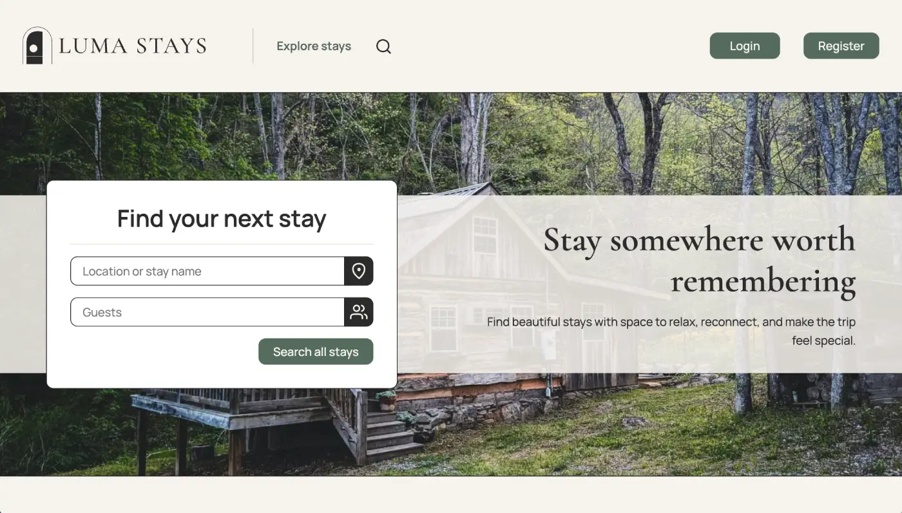

# Luma Stays

Luma Stays is a front-end accommodation booking application built for Noroff Project Exam 2. The project uses the Holidaze API and allows users to browse venues, create bookings, and manage venues depending on their account type.

## Preview



## Live Site

[Luma Stays App](https://luma-stays.netlify.app/)

## GitHub Repository

[GitHub repository](https://github.com/KatjaTurnsek/luma-stays)

## Planning and Design

- [GitHub kanban board](https://github.com/users/KatjaTurnsek/projects/4)
- [GitHub roadmap view](https://github.com/users/KatjaTurnsek/projects/4/views/4?filterQuery=assignee%3AKatjaTurnsek)
- [Figma style guide](https://www.figma.com/design/L5xZ4AgRdzgWpowmBUeHSS/projects-2?node-id=1053-134&t=knPQnhx20euH5OhT-1)
- [Figma prototype/design mobile](https://www.figma.com/design/L5xZ4AgRdzgWpowmBUeHSS/projects-2?node-id=1076-14347&t=knPQnhx20euH5OhT-1)
- [Figma prototype/design desktop](https://www.figma.com/design/L5xZ4AgRdzgWpowmBUeHSS/projects-2?node-id=1060-2670&t=knPQnhx20euH5OhT-1)

## Description

Luma Stays is designed as a calm and premium booking experience. Visitors can browse and search venues, view venue details, and check available dates. Registered customers can create and manage bookings. Venue managers can create, edit, and delete venues, view upcoming bookings for their venues, and update their profile avatar.

## Built With

- React
- Vite
- JavaScript
- Bootstrap
- CSS
- Noroff Holidaze API
- JSDoc
- ESLint
- Prettier

## Features

### All Users

- View a list of venues
- Search for venues
- Filter venues by guest count
- Sort venues by newest, price, or rating
- View a specific venue page
- View availability and booked dates in a calendar
- Register as a customer or venue manager

### Customers

- Log in and log out
- Create bookings
- View upcoming bookings
- Cancel bookings
- Update profile avatar

### Venue Managers

- Log in and log out
- Create venues
- Edit venues
- Delete venues
- Add or update venue rating
- View upcoming bookings for managed venues
- Update profile avatar

## Getting Started

### Install

```bash
npm install
```

### Environment Variables

Create a `.env` file in the project root and add your Noroff API key:

```env
VITE_NOROFF_API_KEY=your_api_key_here
```

### Run Locally

```bash
npm run dev
```

### Build

```bash
npm run build
```

### Preview Build

```bash
npm run preview
```

### Lint

```bash
npm run lint
```

### Format Check

```bash
npm run format:check
```

### Format Code

```bash
npm run format
```

### Generate JSDoc

```bash
npm run docs
```

## API

This project uses the Noroff API v2 Holidaze endpoints for venues, bookings, profiles, authentication, and API key handling.

API documentation:  
https://docs.noroff.dev/docs/v2/holidaze/venues

## Testing

The project was tested with:

- Manual user story testing
- ESLint
- Prettier format check
- Vite production build
- Browser responsive testing
- HTML Validator
- Lighthouse
- WAVE accessibility checker

Main flows tested:

- Visitor browsing and searching venues
- Customer registration, login, booking, profile, avatar update, and logout
- Venue manager registration, login, venue create/edit/delete, booking overview, avatar update, and logout

See detailed testing documentation here: [TESTING.md](./TESTING.md)

## Maintenance Notes

After the original exam submission, the project was reviewed and improved with a focus on maintainability, clearer user states, and code consistency.

Post-submission improvements include:

- Improved venue search across names, descriptions, locations, amenities, owners, and guest counts
- Safer venue editing so existing media is preserved when only text or price details are changed
- Clearer venue detail states for visitors, customers, venue managers, and venue owners
- Booking feedback for customers who already have upcoming bookings for a venue
- Route-based code splitting with React lazy loading
- Dynamic page metadata for React routes, including Open Graph and Twitter preview tags
- Prettier setup with formatting scripts
- Dependency review after `npm audit`, with safe updates applied where appropriate

One remaining React Router audit advisory relates to unstable RSC APIs. This project is a client-side Vite React app and does not use React Server Components or server actions.

## Project Structure

```text
src/
  api/
  assets/
  components/
  hooks/
  layouts/
  pages/
  styles/
  utils/
```

## AI Usage

AI was used as a support tool for brainstorming, concept clarification, test data, documentation drafts, and discussion of possible solutions. The suggestions were reviewed and adapted to fit the project brief and application requirements.

See the full log here: [AI Usage Log](./AI_LOG.md)

## Author

Katja Turnšek  
Front-End Developer & UI/UX Designer  
GitHub: https://github.com/KatjaTurnsek
